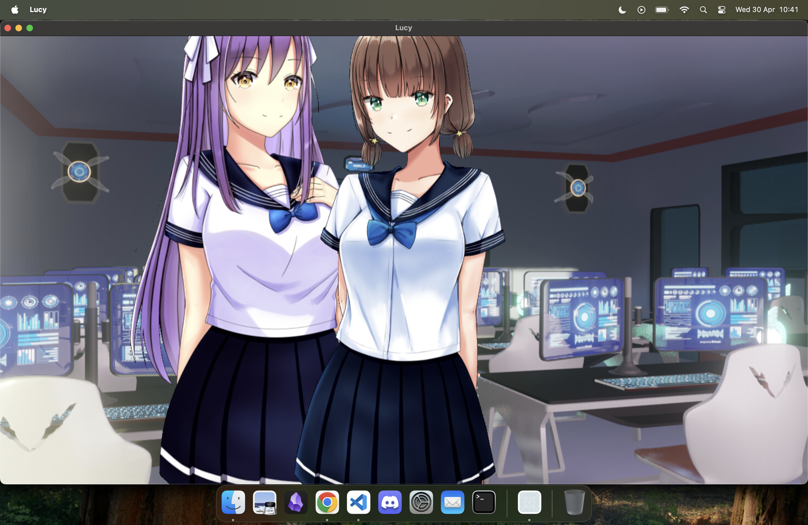

# Lucy

An experimental C++23, Objective-C++ and Metal visual novel renderer (WIP)

## Dependencies

### General

- CMake 3.31.3
- Git 2.47.1

### For macOS

- Apple Silicon M1+
- A GPU able to run Metal Shading Language 3.2
- macOS 15.2+
- Xcode 16.2+

## Capabilities

It can decode QOI images, render the resulting texture into an sprite, and move the sprites along the scene, with a multi-layered z-buffer to have a feeling of depth in the scene. There's an example of this in Editor/Game.cpp:

## Documentation

To read the documentation, you should open the Markdown files under the Documentation folder.

It's recommended to use a Markdown renderer, like Obsidian, to read these.